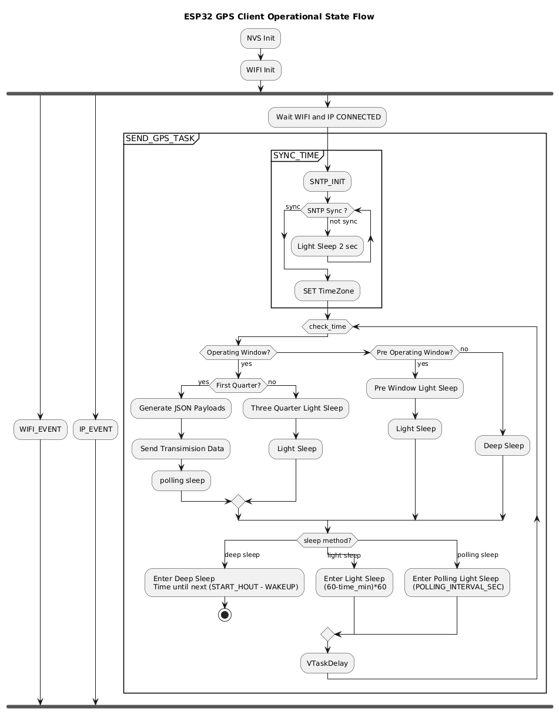

# Buddy GPS Tracking

# Section 1 *Web Application*


A web application to track and display GPS data from an ESP32 device, designed for tracking a pet.

## Features

*   **Real-time Data Display:** View the latest GPS data from your device in a clean, sortable table.
*   **Data Refresh:** Manually refresh the data to get the latest updates.
*   **CSV Export:** Download all stored GPS data as a CSV file for further analysis.

## Tech Stack

*   **Frontend:** [Leptos](https://leptos.dev/) (Rust)
*   **Backend:** [Actix](https://actix.rs/) (Rust)
*   **Styling:** [Tailwind CSS](https://tailwindcss.com/)
*   **Testing:** [Playwright](https://playwright.dev/)

## Getting Started

### Prerequisites

*   [Rust](https://www.rust-lang.org/tools/install)
*   [cargo-leptos](https://github.com/leptos-rs/leptos/tree/main/cargo-leptos)
*   [Node.js](https://nodejs.org/en/) (for end-to-end testing and tailwind )
*   [Docker](https://docs.docker.com/desktop/?_gl=1*1h3b8e6*_gcl_au*MjEwNTA0Mjg0MC4xNzYyMjcwMjIx*_ga*MTU5ODE3NzM2Mi4xNzYyMjcwMTY4*_ga_XJWPQMJYHQ*czE3NjIyNzAxNjckbzEkZzEkdDE3NjIyNzIxNzckajU5JGwwJGgw) (Optional: for running app directly)

### Local Installation and Running

1.  **Install `cargo-leptos`:**
    ```bash
    cargo install cargo-leptos
    ```
    Or following getting start here [GettingStart](https://github.com/leptos-rs/cargo-leptos)

2.  **Build and run the application:**
    ```bash
    cargo leptos watch
    ```

3.  **Open your browser** to `http://127.0.0.1:3000`.

### Using Docker for Starting Application

    docker run -p 8080:8080 chinouplus/buddy-gps-tracking:latest

### Testing Send Data to Application using `curl`
    
    curl -X POST http://0.0.0.0:8080/api/data -H "Content-Type: application/json" -d '{
        "id": "ESP32_001",
        "payload": "1A2B3C4DEF", # 10 Hex Chars for 4xlongtitude, 4xlattitude and 2xbattery
        "date": "2025-10-31",
        "time": "18:05:22"
    }'

# section 2 *NODE Firmware*

### Firmware State Flow Diagram


## Features

*   **periodically Data Transamision** telemetry sending interval data to server by HTTP requested -- configurable 
*   **Power Optimization** optimizing power consomption using Light Sleep and Deep Sleep

## Development

*  **VS-Code** with **ESP-IDF** extension
    